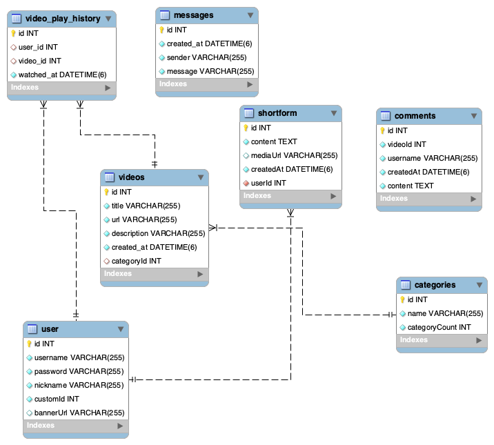

<p align="center">
  <a href="http://nestjs.com/" target="blank"></a>
</p>
  <p align="center">SDEK팀 비디오 관련 서비스API</p>

# Wacherry Streaming Platform

## Made by 세명대학교 스마트IT학부 SDEK팀 [🏆캡스톤디자인 우수작품 수상]

## 지도교수: 이명호

## 지도지원: 조면균

## 팀 리더: 이성혁 (아키텍처 설계 및 총 책임자)

## 팀 멤버: 최민성(동영상 자료수집), 정호성(작동 테스트), 박윤호(동영상 편집 및 업스케일 작업)

## 웹 서버: 비동기 웹 프레임워크 NGINX (최신버전 사용), HTTPS 적용함

## Skill: NestJS(최신버전 사용) 및 관련 Plugin(최신버전 사용), 암호화처리: SHA-256

## 최신버전: 즉 수시로 새버전 나올때 마다 업그레이드 함, 보안 측면을 고려함

## 호스팅 사업자: Amazon Web Service (AWS)

## ERD



## UCD


## Skill: Nest.js + bun

### 이 Repository는 Nest.js과 bun로 구축된 Back-end로 구현된 비디오 스트리밍 서비스 API를 제공합니다. 이 서비스는 비디오 업로드, HLS 기반 스트리밍, 실시간 채팅 기능 로직을 구현했습니다.

## 의존 S/W 컴포넌트

```
   "@nestjs-modules/mailer": "^2.0.2",
    "@nestjs/common": "^10.0.0",
    "@nestjs/core": "^10.0.0",
    "@nestjs/jwt": "^10.2.0",
    "@nestjs/passport": "^10.0.3",
    "@nestjs/platform-express": "^10.4.6",
    "@nestjs/platform-socket.io": "^10.4.6",
    "@nestjs/typeorm": "^10.0.2",
    "@nestjs/websockets": "^10.4.5",
    "bcryptjs": "^2.4.3",
    "class-transformer": "^0.5.1",
    "class-validate": "^0.0.1",
    "multer": "^1.4.5-lts.1",
    "mysql2": "^3.11.3",
    "passport": "^0.7.0",
    "passport-jwt": "^4.0.1",
    "passport-local": "^1.0.0",
    "reflect-metadata": "^0.2.0",
    "rxjs": "^7.8.1",
    "socket.io": "^4.8.0",
    "typeorm": "^0.3.20",
    "uuid": "^10.0.0"
    개발용 의존:
    "@nestjs/cli": "^10.0.0",
    "@nestjs/schematics": "^10.0.0",
    "@nestjs/testing": "^10.0.0",
    "@types/express": "^5.0.0",
    "@types/jest": "^29.5.2",
    "@types/multer": "^1.4.12",
    "@types/node": "^20.3.1",
    "@types/passport-local": "^1.0.38",
    "@types/supertest": "^6.0.0",
    "@typescript-eslint/eslint-plugin": "^8.0.0",
    "@typescript-eslint/parser": "^8.0.0",
    "eslint": "^9.0.0",
    "eslint-config-prettier": "^9.0.0",
    "eslint-plugin-prettier": "^5.0.0",
    "jest": "^29.5.0",
    "prettier": "^3.0.0",
    "source-map-support": "^0.5.21",
    "supertest": "^7.0.0",
    "ts-jest": "^29.1.0",
    "ts-loader": "^9.4.3",
    "ts-node": "^10.9.1",
    "tsconfig-paths": "^4.2.0",
    "typescript": "^5.1.3"
```

## 아키텍처 구성

1. 비디오 플레이어, 사용자 UI 제공
2. 모던 UI 프레임워크 적용
3. 실시간 데이터 업데이트
4. 비디오 플레이어 HLS 기술 적용

## 작동 방법

### 의존성 설치

```
bun install
```

### 개발 서버 실행

```
bun run start:dev
```

### 최종 빌드

```
bun run build
```

## 문의

해당 Repository 문의는 이메일: merci726@yahoo.com 문의하세요.

## 라이선스

해당 프로젝트는 사유 라이선스를 따릅니다. 자세한 내용은 LICENSE 파일을 참고하세요.
